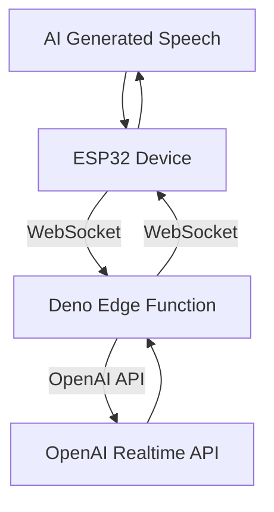
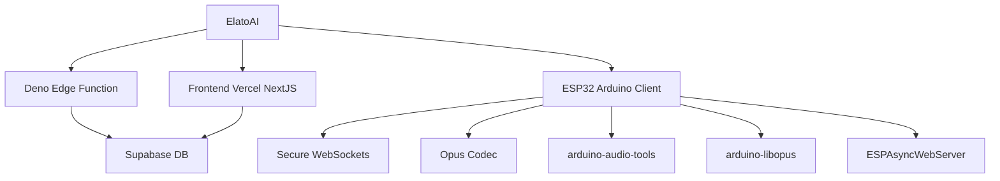

# 🪄 ElatoAI: Realtime AI Speech for ESP32

Realtime AI Speech powered by OpenAI Realtime API, ESP32, Secure WebSockets, and Deno Edge Functions for >10-minute uninterrupted global conversations


<div align="center">

[](https://discord.gg/KJWxDPBRUj)
[](https://www.gnu.org/licenses/gpl-3.0.en.html)&ensp;&ensp;&ensp;


</div>


## 📺 Demo Video

https://github.com/user-attachments/assets/aa60e54c-5847-4a68-80b5-5d6b1a5b9328

<a href="https://www.youtube.com/watch?v=o1eIAwVll5I">
  
</a>


## Getting Started

1. Install [Supabase CLI](https://supabase.com/docs/guides/local-development/cli/getting-started) and set up your Local Supabase Backend. From the root directory, run:
```bash
brew install supabase/tap/supabase
supabase start # Starts your local Supabase server with the default migrations and seed data.
```

2. Set up your NextJS Frontend. ([See the Frontend README](frontend-nextjs/README.md)) From the `frontend-nextjs` directory, run the following commands. (**Login creds:** Email: admin@elatoai.com, Password: admin)
```bash
cd frontend-nextjs
npm install

# Set your environment variables
cp .env.example .env.local
# NEXT_PUBLIC_SUPABASE_ANON_KEY=<your_supabase_anon_key>
# OPENAI_API_KEY=<your_openai_api_key>

# Run the development server
npm run dev
```

3. Add your ESP32-S3 Device MAC Address to the [Settings page](http://localhost:3000/home/settings) in the NextJS Frontend. This links your device to your account.
To find your ESP32-S3 Device's MAC Address, build and upload `test/print_mac_address_test.cpp` using PlatformIO.

4. Add your OpenAI API Key in the `server-deno/.env` and `frontend-nextjs/.env.local` file.
```
OPENAI_API_KEY=<your_openai_api_key>
```

5. Start the Deno server. ([See the Deno server README](server-deno/README.md))
```bash
# Navigate to the server directory
cd server-deno

# Set your environment variables
cp .env.example .env
# NEXT_PUBLIC_SUPABASE_ANON_KEY=<your_supabase_anon_key>
# OPENAI_API_KEY=<your_openai_api_key>

# Run the server at port 8000
deno run -A --env-file=.env main.ts
```

5. Set up your ESP32 Arduino Client. ([See the ESP32 README](firmware-arduino/README.md)) On PlatformIO, first `Build` the project, then `Upload` the project to your ESP32.

6. The ESP32 should open an AP `ELATO-DEVICE` to connect to Wifi. Connect to it and go to `http://192.168.4.1` to configure the device wifi.

7. Once your Wifi is configured, turn the device off and on again and it should connect to your Wifi and the Deno edge server.

8. Now you can talk to your AI Character!

## 📌 Project Architecture

ElatoAI consists of three main components:

1. **Frontend Client** (`Next.js` hosted on Vercel) - to create and talk to your AI agents and 'send' it to your ESP32 device
2. **Edge Server Functions** (`Deno` running on Deno/Supabase Edge) - to handle the websocket connections from the ESP32 device and the OpenAI API calls
3. **ESP32 IoT Client** (`PlatformIO/Arduino`) - to receive the websocket connections from the Edge Server Functions and send audio to the OpenAI API via the Deno edge server.


## 🌟 Features

1. **Realtime Speech-to-Speech**: Instant speech conversion powered by OpenAI's Realtime APIs.
2. **Create Custom AI Agents**: Create custom agents with different personalities and voices.
3. **Customizable Voices**: Choose from a variety of voices and personalities.
4. **Secure WebSockets**: Reliable, encrypted WebSocket communication.
5. **Server VAD Turn Detection**: Intelligent conversation flow handling for smooth interactions.
6. **Opus Audio Compression**: High-quality audio streaming with minimal bandwidth.
7. **Global Edge Performance**: Low latency Deno Edge Functions ensuring seamless global conversations.
8. **ESP32 Arduino Framework**: Optimized and easy-to-use hardware integration.
9. **Conversation History**: View your conversation history.
10. **Device Management**: Register and manage your devices.
11. **User Authentication**: Secure user authentication and authorization.
12. **Conversations with WebRTC and Websockets**: Talk to your AI with WebRTC on the NextJS webapp and with websockets on the ESP32.
13. **Volume Control**: Control the volume of the ESP32 speaker from the NextJS webapp.
14. **Realtime Transcripts**: The realtime transcripts of your conversations are stored in the Supabase DB.

## 🛠 Tech Stack

| Component       | Technology Used                          |
|-----------------|------------------------------------------|
| Frontend        | Next.js, Vercel            |
| Backend         | Supabase DB  |
| Edge Functions  | Deno Edge Functions on Deno/Supabase          |
| IoT Client      | PlatformIO, Arduino Framework, ESP32-S3  |
| Audio Codec     | Opus                                     |
| Communication   | Secure WebSockets                        |
| Libraries       | ArduinoJson, WebSockets, AsyncWebServer, ESP32_Button, Arduino Audio Tools, ArduinoLibOpus        |


## 🗺️ High-Level Flow




## 📂 Project Structure



## ⚙️ PlatformIO Configuration

```ini
[env:esp32-s3-devkitc-1]
platform = espressif32 @ 6.10.0
board = esp32-s3-devkitc-1
framework = arduino
monitor_speed = 115200

lib_deps =
    bblanchon/ArduinoJson@^7.1.0
    links2004/WebSockets@^2.4.1
    ESP32Async/ESPAsyncWebServer@^3.7.6
    https://github.com/esp-arduino-libs/ESP32_Button.git#v0.0.1
    https://github.com/pschatzmann/arduino-audio-tools.git#v1.0.1
    https://github.com/pschatzmann/arduino-libopus.git#a1.1.0
```


## 📊 Important Stats

- ⚡️ **Latency**: <1s round-trip globally
- 🎧 **Audio Quality**: Opus codec at 24kbps (high clarity)
- ⏳ **Uninterrupted Conversations**: Up to 10 minutes continuous conversations
- 🌎 **Global Availability**: Optimized with edge computing with Deno

## 🛡 Security

- Secure WebSockets (WSS) for encrypted data transfers
- Optional: API Key encryption with 256-bit AES
- Supabase DB for secure authentication
- Supabase RLS for all tables

## 🚫 Limitations

- Limited to upto 10 minutes of uninterrupted conversations
- Edge server stops when wall clock time is exceeded
- No speech interruption detection on ESP32

## 🤝 Contributing

1. Looking for Speech Interruption detection on ESP32
2. Adding Arduino IDE support
3. Adding tool calling support on Deno Edge

We welcome contributions
- Fork this repository.
- Create your feature branch (`git checkout -b feature/EpicFeature`).
- Commit your changes (`git commit -m 'Add EpicFeature'`).
- Push to the branch (`git push origin feature/EpicFeature`).
- Open a PR


## 📜 License

This project is licensed under the MIT License - see the [LICENSE](LICENSE) file for details.

---

🎉 **Give a ⭐️ if you found this project interesting :)**

