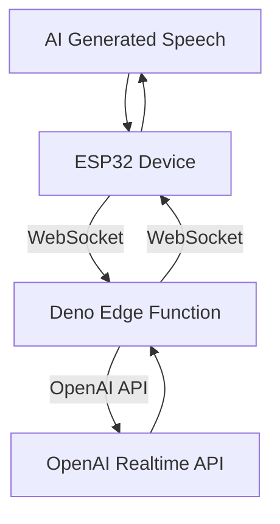
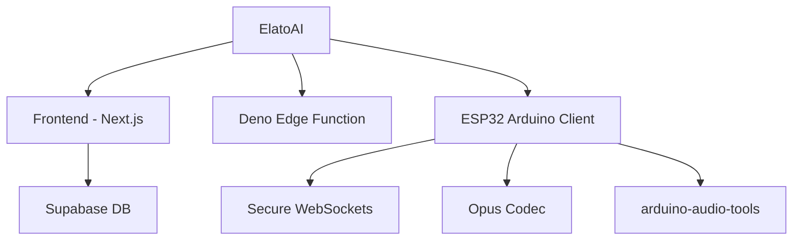

# 🚀 ElatoAI: Realtime AI Speech for ESP32

**Realtime AI Speech powered by OpenAI Realtime API, ESP32, Secure WebSockets, and Deno Edge Functions for >10-minute uninterrupted global conversations!**

## 📺 Demo Video

https://github.com/user-attachments/assets/aa60e54c-5847-4a68-80b5-5d6b1a5b9328

<a href="https://www.youtube.com/watch?v=o1eIAwVll5I">
  
</a>

*Click the image above to watch the demo video on YouTube*
---

## 🌟 Features

- **Realtime Speech-to-Speech**: Instant speech conversion powered by OpenAI's Realtime APIs.
- **Secure WebSockets**: Reliable, encrypted WebSocket communication.
- **Server Turn Detection**: Intelligent conversation flow handling for smooth interactions.
- **Opus Audio Compression**: High-quality audio streaming with minimal bandwidth.
- **Global Edge Performance**: Low latency Deno Edge Functions ensuring seamless global conversations.
- **ESP32 Arduino Framework**: Optimized and easy-to-use hardware integration.

---

## 📌 Project Architecture

ElatoAI consists of three main components:

1. **Frontend Client** (`Next.js` hosted on Vercel)
2. **Edge Server Functions** (`Deno` running on Supabase Edge)
3. **ESP32 IoT Client** (`PlatformIO/Arduino`)

---

## 🛠 Tech Stack

| Component       | Technology Used                          |
|-----------------|------------------------------------------|
| Frontend        | Next.js, Vercel, Supabase DB             |
| Edge Functions  | Deno Edge Functions on Supabase          |
| IoT Client      | PlatformIO, Arduino Framework, ESP32-S3  |
| Audio Codec     | Opus                                     |
| Communication   | Secure WebSockets                        |
| Libraries       | ArduinoJson, WebSockets, AsyncTCP        |

---

## 🗺️ High-Level Flow



---

## 📂 Project Structure



---

## ⚙️ PlatformIO Configuration

```ini
[env:esp32-s3-devkitc-1]
platform = espressif32 @ 6.10.0
board = esp32-s3-devkitc-1
framework = arduino
monitor_speed = 115200

lib_deps =
    bblanchon/ArduinoJson@^7.1.0
    links2004/WebSockets@^2.4.1
    https://github.com/esp-arduino-libs/ESP32_Button.git
    https://github.com/pschatzmann/arduino-audio-tools.git#v1.0.1
    https://github.com/pschatzmann/arduino-libopus.git
    ESP32Async/AsyncTCP
    ESP32Async/ESPAsyncWebServer
```

---

## 📊 Important Stats

- ⚡️ **Latency**: <150ms round-trip globally
- 🎧 **Audio Quality**: Opus codec at 24kbps (high clarity)
- ⏳ **Uninterrupted Conversations**: Over 10 minutes continuous conversations
- 🌎 **Global Availability**: Optimized with edge computing via Supabase

---

## 🛡 Security

- Secure WebSockets (WSS) for encrypted data transfers
- Edge validation and error handling for robust, secure deployment

---

## 🤝 Contributing

We welcome contributions!

- Fork this repository.
- Create your feature branch (`git checkout -b feature/AmazingFeature`).
- Commit your changes (`git commit -m 'Add AmazingFeature'`).
- Push to the branch (`git push origin feature/AmazingFeature`).
- Open a pull request!

---

## 📜 License

This project is licensed under the MIT License - see the [LICENSE](LICENSE) file for details.

---

🎉 **Give a ⭐️ if you found this project interesting!**

